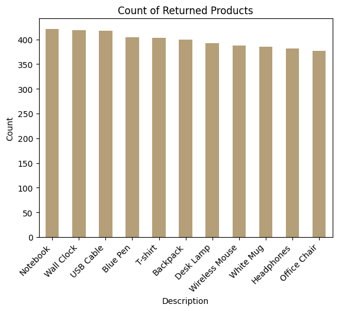
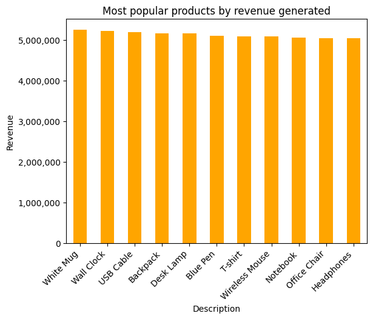
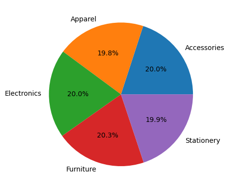
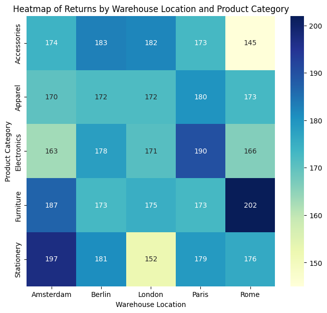
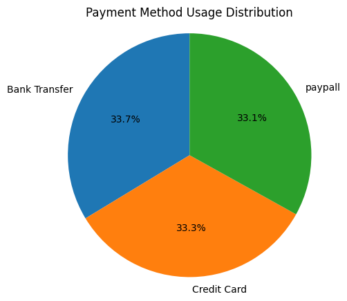
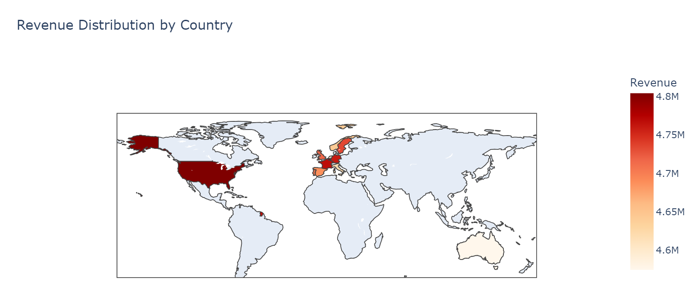
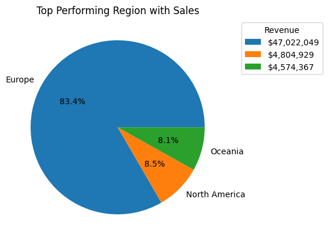

# Online-Sales-Data-Analysis

## Project Description 
This project focuses on analyzing sales data to gain insights into customer behavior, product performance, geographical trends, and channel effectiveness. Using Python and various data visualization libraries, I performed data cleaning, exploratory data analysis, and visualizations to answer key business questions. This analysis helps identify top-selling products, customer preferences, returns patterns, and potential areas for operational improvement.

## Dataset:
- online_sales_dataset.csv

## Software:
- Python 3.11
- Visual Studio Code 1.95
- Jupyter Notebook

## Sales Distribution by Country
A bar chart showing total revenue distribution by country. This highlights the highest-performing countries.

.png)

## Returns across Product Categories & Shipment Providers
This chart shows return rates for different product categories and shipment providers. This analysis helps identify categories with high returns and potentially addresses quality or expectations alignment issues.

## Count of Returned Products
The chart displays the count of returned products. Notebook, wall clock, and USB cable are the top three products that are returned, each with counts above 400.

## Most Popular Products by Revenue generated
A bar chart representing the most product products sold. This helps understand product demand and guides stocking decisions.

## Pie Chart of Revenue share by Category
The pie chart shows each category's percentage contribution to total revenue, highlighting the major revenue-driving categories.

## Heatmap of Returns by Warehouse Location and Product Category
The heatmap displays the volume of returns across different warehouse locations and product categories, with color intensity indicating the return frequency for each category-location pair.

## Payment Method Usage Distribution
The pie chart illustrates the distribution of usage across different payment methods, showing the share each method holds in overall transactions.

##  Revenue Distribution by Country ( World map chart)
The world map chart visualizes revenue distribution by country, with color gradients representing the revenue levels across regions, allowing quick identification of high and low revenue-generating countries.

## OrderPriority vs ShippingCost
The box plot shows the sipping costs against order priority.

.png)

## Top Performing Region with Sales
The chart highlights the top-performing region based on sales figures, showcasing the region with the highest contribution to overall sales. According to the data Europe takes the leading spot with most sales.

